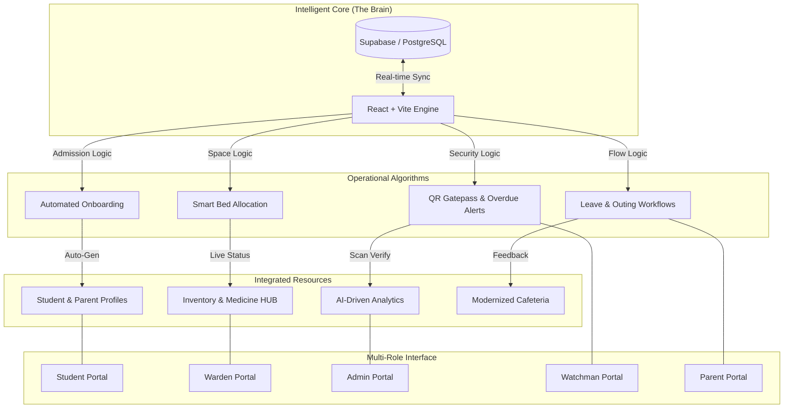

# 🏠 HosteliHub — Advanced Hostel Management System
### *Geethanjali Institute of Science & Technology (GIST)*

[](https://vitejs.dev/)
[](https://reactjs.org/)
[](https://www.typescriptlang.org/)
[](https://supabase.com/)
[](https://tailwindcss.com/)

---

## 📌 Overview
**HosteliHub** is a high-performance, real-time, full-stack hostel administration ecosystem specifically engineered for the needs of GIST students and staff. It bridges the gap between manual entry and automated efficiency, providing a unified portal for wardens, students, parents, and administrators.

---

## 🏗️ System Architecture Algorithm
HosteliHub operates on a **Single Unified Intelligence Algorithm**. Unlike traditional fragmented systems, every event (like a QR scan or a fee payment) triggers a reactionary chain across all five portals simultaneously.



> [!TIP]
> **Data Consistency**: When a Watchman scans a student's QR code, the **Security Logic** instantly updates the student's status, notifies the Parent, and informs the Warden of the successful check-in/out in one single computational pass.

---

## 🚀 Core Technology Stack

### 🔹 Frontend (The UI Engine)
- **React 18 & TypeScript**: Ensures a robust, type-safe development environment.
- **Tailwind CSS**: Custom HSL-based design tokens for high-performance light/dark mode.
- **Framer Motion**: Premium micro-animations for the SplashScreen and dashboard transitions.
- **TanStack Query (React Query)**: Advanced server-state synchronization and caching.

### 🔹 Backend & Database (The Logic Engine)
- **Supabase (PostgreSQL)**: Handles the relational database, Authentication, Real-time broadcasting, and Edge Functions (for Email service).
- **Vite Middleware (Local API)**: A custom Node.js plugin for file-system-based logging and fallback JSON storage.
- **Resend API**: Real-time email notification engine for alerts and approvals.

---

## 👤 Comprehensive Portal Details

### 🎓 1. Student Portal (Boys & Girls Portals)
*Designed as the central hub for the student's residential lifecycle.*

| Feature Name | Usage & Purpose |
| :--- | :--- |
| **Digital Gate Pass** | Allows students to apply for temporary exit (outing) or long leave. Generates a unique QR code for security verification upon approval. |
| **Medical SOS Alert** | An emergency button to notify the Warden and Guardian if the student falls ill. Includes a view of available medicines in the hostel inventory. |
| **Academic Resource Hub** | Instant access to branch and year-specific study materials (PDFs/Links) and semester-wise marks tracking. |
| **Financial Dashboard** | Secure view of the fee structure, total amount paid, and balance due. Includes a payment history and redirect to the payment portal. |
| **Issue Reporting** | Multi-category problem reporting for Food, Electrical, or Room issues with live status tracking (Pending/Resolved). |
| **Hostel Albums** | View multi-image event photos and gallery updates from the hostel life. |
| **Course-Specific View** | Dynamic filtering for B.Tech and Diploma branches in the academic and profile sections. |
| **Real-time Fee Sync** | Academic year-wise fee breakdown with instant feedback on transaction status. |
| **SplashScreen & UX** | Premium animated entry and optimized keyboard navigation (Enter key focus). |
| **Daily Attendance** | View current presence status and access monthly attendance reports. |
| **Food Preference Voting** | Students vote for their daily meal preferences, helping the mess management reduce food waste. |

---

### 👨‍👩‍👧 2. Parent Portal
*Provides transparency and peace of mind for guardians through roll-number-based tracking.*

| Feature Name | Usage & Purpose |
| :--- | :--- |
| **Real-time Monitoring** | Parents can see if their child is currently "Inside" or "Outside" the campus based on security logs. |
| **Leave Extension** | If a child is already on approved leave, parents can digitally request an extension of days for the Warden to review. |
| **Medical History** | A complete log of all medical alerts ever reported by the student, ensuring parents are informed about their child's health history. |
| **Financial Transparency** | Detailed breakdown of annual dues and a verified history of all payments made throughout the academic stay. |
| **Direct Contact Hub** | Easy-access deep-links to contact the Warden or Emergency Security via WhatsApp or Phone call. |
| **Hostel Gallery** | View event albums and photos of hostel activities to stay connected with campus life. |
| **Academic Progress** | View monthly attendance percentages and academic performance reports provided by the hostel. |

---

### 🏫 3. Warden Portal
*The administrative heart of the hostel, managing approvals, rooms, and emergencies.*

| Feature Name | Usage & Purpose |
| :--- | :--- |
| **Approval Engine** | One-stop queue for reviewing Incoming Student Applications and Gate Pass requests. Includes digital signature verification. |
| **Intelligence Dashboard** | Real-time charts showing pending rooms, total occupancy, and active gate pass counts. |
| **Room Map & Allotment** | A visual map of every floor and room. Automatically seeks and blocks rooms based on student floor/AC preferences. |
| **Medical Management** | Unified alert center for incoming SOS signals. Enables wardens to manage the medicine inventory levels. |
| **Material Distribution** | Portal to upload study materials and syllabus updates to specific student branches or years. |
| **Overdue Tracking** | Automatically triggers alerts for students who have not returned to campus by their specified gate-pass time. |
| **Album Management** | Upload and manage event photos with multi-image support for Student/Parent galleries. |
| **Course-Based Uploads** | Categorize and distribute study materials specifically for B.Tech or Diploma students. |
| **Recycle Bin** | Safety mechanism to recover accidentally deleted student or staff records. |

---

### 🛡️ 4. Admin Portal
*Governance tools for senior management to oversee institution-wide operations.*

| Feature Name | Usage & Purpose |
| :--- | :--- |
| **Staff & Security Control** | Onboarding and approval for new Warden and Watchman accounts via secure token generation. |
| **Financial Audit** | Master view of total fee collection, institutional revenue from application fees, and individual debt tracking. |
| **Unified Directory** | Highly searchable database containing every student resident with advanced branch/year filtering. |
| **Room Oversight** | High-level monitoring of room occupancy across AC and Standard blocks to plan for future admissions. |
| **Announcements** | Sending system-wide notifications and updates displayed across all portals. |
| **Advanced Filtering** | Seamlessly filter the entire student directory by Course (B.Tech/Diploma) and Branch. |
| **Architecture Access** | Unified view of the system's technical architecture and data flow for governance. |
| **System Maintenance** | Critical tools for master data reset (protected by manual override) and system health monitoring. |

---

### 🛂 5. Gatepass Security (Watchman Portal)
*The front-line defense, ensuring perimeter security via digital logging.*

| Feature Name | Usage & Purpose |
| :--- | :--- |
| **QR Scan Architecture** | Real-time camera-based scanner to verify student digital tokens instantly. Prevents fraudulent entry/exit. |
| **Manual Authorization** | Fallback search feature to authorize a student via Roll Number if their digital device is unavailable. |
| **Movement Execution** | Digital logging of the exact second a student exits or enters the gate, synchronizing with the Warden and Parent dashboards. |
| **"Out Students" Monitoring** | A live dashboard showing every student currently off-campus, helping security maintain accountability at all times. |
| **Scanner Persistence** | Improved QR scanner architecture ensuring continuous functionality during long shifts. |

| **Identity Verification** | Displays the student's photo and Father's name upon scan to ensure the correct individual is passing. |

---

## 🎨 Design System

| Element | Description |
|---|---|
| **Typography** | Poppins (Sans-Serif) for UI, Playfair Display (Serif) for Premium headers. |
| **Theming** | HSL-based dynamic colors. `35, 30%, 97%` for Light mode and `220, 30%, 8%` for Dark mode. |
| **Interface** | Glassmorphism card effects using backdrop-blur and 1px borders. |

---

## 📂 Installation & Setup

1. **Clone & Install**:
   ```bash
   git clone https://github.com/Vasu-soc/Hostel-management-system.git
   npm install
   ```

2. **Environment**: Create `.env` in root:
   ```env
   VITE_SUPABASE_URL=your_url
   VITE_SUPABASE_PUBLISHABLE_KEY=your_key
   ```

3. **Run Dev Server**:
   ```bash
   npm run dev
   ```

---

**© 2024 Geethanjali Institute of Science & Technology**  
*Developed with ❤️ for the GIST Community.*
