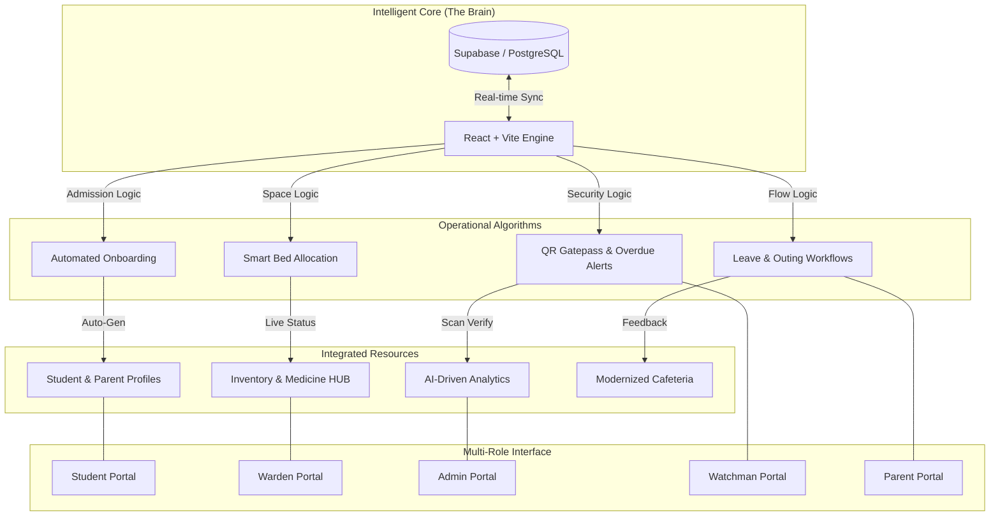

# 🏠 HosteliHub — Advanced Hostel Management System
### *Geethanjali Institute of Science & Technology (GIST)*

[](https://vitejs.dev/)
[](https://reactjs.org/)
[](https://www.typescriptlang.org/)
[](https://supabase.com/)
[](https://tailwindcss.com/)

---

## 📌 Overview
**HosteliHub** is a state-of-the-art, real-time, full-stack hostel administration ecosystem specifically engineered for the needs of GIST students and staff. It bridges the gap between manual entry and automated efficiency, providing a unified portal for administrators, wardens, students, parents, and security personnel.

---

## 🏗️ System Architecture & Logic
HosteliHub operates on a **Single Unified Intelligence Algorithm**. Every event (like a QR scan or a fee payment) triggers a reactionary chain across all five portals simultaneously via real-time WebSocket layers (Supabase Channels).

### 🛠️ Architecture Diagram


---

## 🚀 Technical Stack Breakdown

### 🎨 Frontend (Interface & Interaction)
- **Framework:** React 18 with TypeScript for type-safe, component-driven development.
- **Build Tool:** Vite for lightning-fast HMR and production builds.
- **Styling:** Custom Vanilla CSS & Tailwind CSS utilizing HSL color tokens for seamless Light/Dark mode transitions.
- **Components:** Shadcn/UI for accessible, high-quality primitive components.
- **Animations:** Framer Motion for premium micro-animations (Transitions, SplashScreens, Hover effects).
- **Icons:** Lucide-React for consistent, vectorized iconography.
- **Visuals:** Three.js (React Three Fiber) for 3D elements and high-fidelity landing carousels.

### ⚙️ Backend & Database (Logic & Persistence)
- **Infrastructure:** Supabase (PostgreSQL) for a relational, real-time backend.
- **Authentication:** Role-Based Access Control (RBAC) via Supabase Auth and JWT.
- **Real-time Engine:** WebSockets (Supabase Channels) for instant data broadcasting across all devices.
- **Cloud Functions:** Supabase Edge Functions (Deno Runtime) for heavy computations and automated email triggers.
- **File Storage:** Supabase Storage (S3-compliant) for student documents, photos, and study materials.
- **APIs:** Express/Node.js for high-volume background tasks (Medical SOS backend).

### 🛡️ Security & Scanning
- **QR Engine:** `html5-qrcode` for professional-grade browser-based camera scanning.
- **Generation:** `qrcode.react` for dynamic, on-the-fly QR code generation for student gate passes.

---

## 🔄 The Lifecycle Process

### 1. Admission & Onboarding
- **Application:** Student submits a comprehensive hostel application including photo, branch, and room preferences (AC/Non-AC, Floor preference).
- **Verification:** Warden reviews the application. The system automatically filters available rooms matching the student's exact criteria.
- **Confirmation:** Upon Warden acceptance, a student profile is automatically generated, and credentials are sent.
- **Allocation:** Once the student pays the fee and the warden confirms, the system marks the bed as occupied, updating real-time vacancy stats.

### 2. Gate Pass & Movement Tracking
- **Request:** Student applies for a "Gate Pass" (Local Outing) or "Leave" (Home Visit).
- **Approval:** Warden receives a real-time notification to Approve/Reject.
- **Scanning:** Student presents the QR code to the Security (Watchman).
- **Logging:** 
    - **Exit:** Watchman scans QR -> Student status changes to **OUT** -> Parent/Warden notified -> Timestamp logged.
    - **Entry:** Watchman scans QR -> Student status changes to **IN** -> Pass marked as **COMPLETED** -> Overdue alerts cleared.
- **Expiry:** Approved passes automatically expire after 24 hours if not used, ensuring security integrity.

### 3. Medical & SOS Management
- **Trigger:** Student hits the **Medical SOS** button in extreme emergencies.
- **Broadcast:** Instant alerts are sent to the Warden Dashboard, Parent Dashboard, and via automated Emails.
- **Inventory:** Students can view the warden's medicine inventory to check availability of first-aid supplies.

---

## 🎭 Role-Specific Capabilities

### 🎓 1. Student Portal
*The central control center for residential life.*
- **Digital Identity:** Profile management with photo upload and default password security.
- **Gate Pass System:** apply for outing/leave, track status, and view active QR tokens.
- **Financial Desk:** Pay hostel fees, upload payment receipts, and view detailed transaction history.
- **Academic Hub:** Access branch-specific study materials (PDFs) and view internal marks.
- **Issue Tracking:** Report Food, Electrical, or Room issues with live status updates (Pending -> In Progress -> Resolved).
- **Engagement:** Vote for daily mess menus and view hostel event albums.

### 🏫 2. Warden Portal
*The operational backbone of the hostel.*
- **Application Desk:** Advanced queue for processing admissions with automatic room matching logic.
- **Live Monitoring:** Real-time dashboard of student status (IN/OUT), active gate passes, and overdue returns.
- **Resource Management:** Upload study materials, manage medicine inventory, and update event galleries.
- **Safety Center:** Handle Medical SOS alerts and process Leave Extensions requested by parents.
- **Data Integrity:** "Recycle Bin" functionality to recover accidentally deleted records.
- **Reporting:** Generate A4-ready admission forms and attendance reports.

### 🛡️ 3. Security (Watchman) Portal
*The perimeter defense and movement logger.*
- **Intel Scanner:** High-speed QR scanner to authorize entries and exits.
- **Subject Tracking:** Live list of all students currently "Outside Campus".
- **Activity Log:** Comprehensive history of movement with millisecond-accurate timestamps.
- **Flash Access:** Ability to search students by Roll Number for manual entry overrides.

### 👨‍👩‍👧 4. Parent Portal
*Transparency and peace of mind for guardians.*
- **Live Status:** Instant visual indicator of whether their child is inside or outside the hostel.
- **Health Log:** Historical tracking of all medical alerts reported by the student.
- **Financial Viewer:** Monitoring fee payments and outstanding dues.
- **Leave Control:** Direct ability to request leave extensions for their child.

### 👑 5. Admin Portal
*The high-level strategic management layer.*
- **Financial Audit:** Master view of total revenue, collection vs. debt, and historical financial trends.
- **Staff Onboarding:** Secure management of Warden and Security staff credentials.
- **System Maintenance:** Master data control and system health monitoring.
- **Insights:** Clickable statistical cards to filter and analyze the entire hostel population.

---

## 🎨 Design System
| Element | Specification |
|---|---|
| **Typography** | **Poppins** for readability, **Playfair Display** for premium headers. |
| **Color Palette** | **Emerald/Primary** for success, **Rose** for alerts, **Amber** for warnings. |
| **Aesthetics** | Multi-layer Glassmorphism, Backdrop Blurs (10px - 20px), Smooth Gradients. |
| **Interactivity** | Spring-based physics for modal popups and slide transitions. |

---

## 📂 Installation & Deployment

1. **Clone & Install**:
   ```bash
   git clone https://github.com/Vasu-soc/Hostel-management-system.git
   npm install
   ```

2. **Environment Configuration**: Create a `.env` file in the root:
   ```env
   VITE_SUPABASE_URL=your_project_url
   VITE_SUPABASE_PUBLISHABLE_KEY=your_public_key
   ```

3. **Database Setup**: Execute the provided `.sql` migration files in your Supabase SQL Editor.

4. **Run Development Server**:
   ```bash
   npm run dev
   ```

---

**© 2024 Geethanjali Institute of Science & Technology**  
*Developed with ❤️ for the GIST Community.*
