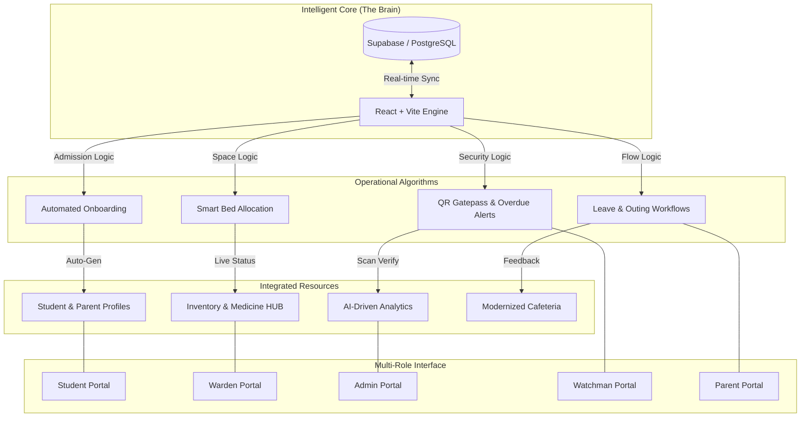

# 🏠 HosteliHub — Advanced Hostel Management System
### *Geethanjali Institute of Science & Technology (GIST)*

[](https://vitejs.dev/)
[](https://reactjs.org/)
[](https://www.typescriptlang.org/)
[](https://supabase.com/)
[](https://tailwindcss.com/)

---

## 📌 Overview
**HosteliHub** is a high-performance, real-time, full-stack hostel administration ecosystem specifically engineered for the needs of GIST students and staff. It bridges the gap between manual entry and automated efficiency, providing a unified portal for wardens, students, parents, and administrators.

---

## 🏗️ System Architecture Algorithm
HosteliHub operates on a **Single Unified Intelligence Algorithm**. Unlike traditional fragmented systems, every event (like a QR scan or a fee payment) triggers a reactionary chain across all five portals simultaneously.



> [!TIP]
> **Data Consistency**: When a Watchman scans a student's QR code, the **Security Logic** instantly updates the student's status, notifies the Parent, and informs the Warden of the successful check-in/out in one single computational pass.

---

## 🚀 Technical Core Depth

### 🧩 1. Frontend (The Visual & Interactive Layer)
The frontend is built to provide a "Zero-Latency" feel with premium aesthetics that wow users at first glance.

- **Elements & Components:**
  - **Framework:** React 18 & TypeScript for a type-safe, component-driven architecture.
  - **Styling:** Custom Vanilla CSS & Tailwind CSS for high-performance HSL-based design (Light/Dark modes).
  - **Premium UI:** Shadcn/UI for accessible components and Framer Motion for micro-animations (Transitions, SplashScreen).
  - **Interactivity:** Innovative **Zoom-Fade Carousel** for landing page visuals and high-fidelity transitions.

- **Functions & Logic:**
  - **State Management:** TanStack Query (React Query) for real-time server-state synchronization and caching.
  - **Dynamic Filtering:** Course-based filtering logic (B.Tech/Diploma) dynamically updates branch options across all portals.
  - **Interactive Dashboards:** Statistical cards in the Admin/Warden panels act as filters (e.g., clicking "Total Boys" filters the student list instantly).
  - **UX Optimizations:** Integrated keyboard navigation (Enter key focus for login) and auto-saving form drafts.

- **Key Features:**
  - **Five-Portal Ecosystem:** Context-aware routing for Admin, Warden, Student, Parent, and Security.
  - **Mobile-First Design:** Fully responsive layouts ensuring usability on tablets and smartphones.
  - **Premium Themes:** Sleek Dark Mode option with glassmorphism effects and backdrop-blur gradients.

### ⚙️ 2. Backend (The Logic & Processing Layer)
HosteliHub utilizes a serverless-focused backend architecture that ensures maximum uptime and security.

- **Elements & Infrastructure:**
  - **Authentication:** Supabase Auth with JWT tokens and role-based metadata.
  - **Edge Runtime:** Supabase Edge Functions to handle heavy computations and email automation.
  - **Notifications:** Resend API for transactional emails (SOS alerts, gate-pass approvals).
  - **Local API:** Custom Vite middleware for system logging and local storage fallbacks.

- **Functions & Process Management:**
  - **Role-Based Access Control (RBAC):** Strict navigation guards that prevent unauthorized access to administrative routes.
  - **Security Scanning:** Logic for QR code verification and real-time movement logging for perimeter security.
  - **Email Engine:** Automatic notification triggers for medical SOS, fee receipts, and overdue alerts.

- **Key Features:**
  - **Real-Time Broadcasting:** Instant alerts across all connected portals when a student reports an SOS or a gate-pass is scanned.
  - **Secure File Storage:** Management of study materials (PDFs) and student documentation with temporary signed URLs.
  - **Architecture Transparency:** Integrated system architectural diagrams and data flow visualization within the Admin panel.

### 💾 3. Database (The Persistence & Data Layer)
A robust PostgreSQL core managed via Supabase provides relational integrity and enterprise-grade security.

- **Elements & Storage:**
  - **PostgreSQL Engine:** Relational database for structured data management.
  - **Supabase Storage:** S3-compliant storage for hostel event albums and student profile photos.
  - **Migration System:** Version-controlled SQL schema to track every change in tables, triggers, and views.

- **Functions & Database Logic:**
  - **Row-Level Security (RLS):** Database policies that ensure students can only see their own data while admins have global access.
  - **Automated Triggers:** SQL functions that automatically update room vacancies when students are admitted or vacated.
  - **Recycle Bin Logic:** Soft-delete implementation allowing Wardens to recover accidentally deleted student or staff records.

- **Key Features:**
  - **Relational Integrity:** Deeply linked tables (Fees, Attendance, Materials, Medical Alerts) ensuring consistent data.
  - **Live Syncing:** Real-time channel subscriptions that push database changes to the frontend without page refreshes.
  - **Financial Auditing:** Master collection tables with detailed debt tracking and academic year-wise fee reporting.

---

## 👤 Comprehensive Portal Details

### 🎓 1. Student Portal (Boys & Girls Portals)
*Designed as the central hub for the student's residential lifecycle.*

| Feature Name | Usage & Purpose |
| :--- | :--- |
| **Digital Gate Pass** | Apply for outing/leave. Generates unique QR for scan. |
| **Medical SOS Alert** | Emergency warden notification + Medicine inventory view. |
| **Academic Hub** | Access PDFs/Materials & track marks by Branch/Year. |
| **Financial Dashboard** | View dues, payments, and academic year-wise breakdown. |
| **Issue Reporting**| Categorized reporting (Food/Electric) with live tracking. |
| **Food Voting**| Students vote for daily meal preferences to reduce mess waste. |
| **Course-Specific View**| Dynamic B.Tech/Diploma branch filtering across the portal. |

### 👨‍👩‍👧 2. Parent Portal
| Feature Name | Usage & Purpose |
| :--- | :--- |
| **Real-time Tracking**| Visual status "Inside/Outside" based on security logs. |
| **Leave Extension** | Request extra days for ongoing leave digitally. |
| **Medical History** | Complete historical log of child's reported illnesses/SOS. |
| **Financial Transparency**| Breakdown of all annual dues and verified payment history. |
| **Direct Contact** | One-tap WhatsApp/Call links for Warden & Emergency Security. |

### 🏫 3. Warden Portal
| Feature Name | Usage & Purpose |
| :--- | :--- |
| **Approval Engine** | Queue for Student Applications and Gate Pass requests. |
| **Room Map** | Visual floor-wise map for automated bed allotment based on AC preference. |
| **Emergency Center** | Centralized dashboard for incoming Medical SOS signals. |
| **Recycle Bin** | Safety tool to recover deleted student or staff records instantly. |
| **Material Upload** | Categorized study material distribution for B.Tech/Diploma. |

### 🛡️ 4. Admin Portal
| Feature Name | Usage & Purpose |
| :--- | :--- |
| **Financial Audit** | Master view of total fee collection vs debt tracking. |
| **Interactive Stats** | Clickable summary cards to filter student lists by category. |
| **Staff Control** | Secure onboarding for Warden and Security staff via tokens. |
| **System Maintenance** | Master data resets and health monitoring tools. |

### 🛂 5. Gatepass Security (Watchman Portal)
| Feature Name | Usage & Purpose |
| :--- | :--- |
| **QR Scan Auth** | Real-time scanner to verify tokens with student photo display. |
| **Movement Log** | Millisecond-accurate logging of every entry and exit event. |
| **Security Dashboard**| Live monitoring of all students currently "Out of Campus". |

---

## 🎨 Design System

| Element | Description |
|---|---|
| **Typography** | Poppins (Sans-Serif) for UI, Playfair Display (Serif) for Premium headers. |
| **Theming** | HSL-based dynamic colors. `35, 30%, 97%` for Light mode and `220, 30%, 8%` for Dark mode. |
| **Interface** | Glassmorphism card effects using backdrop-blur and 1px borders. |

---

## 📂 Installation & Setup

1. **Clone & Install**:
   ```bash
   git clone https://github.com/Vasu-soc/Hostel-management-system.git
   npm install
   ```

2. **Environment**: Create `.env` in root:
   ```env
   VITE_SUPABASE_URL=your_url
   VITE_SUPABASE_PUBLISHABLE_KEY=your_key
   ```

3. **Run Dev Server**:
   ```bash
   npm run dev
   ```

---

**© 2024 Geethanjali Institute of Science & Technology**  
*Developed with ❤️ for the GIST Community.*
